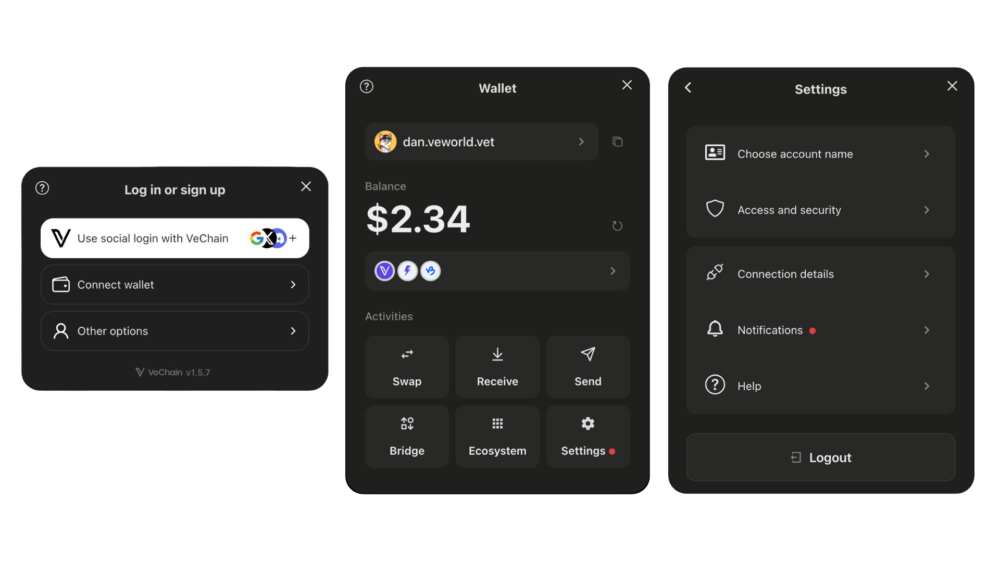

# VeChain Kit V2

<figure><figcaption></figcaption></figure>

**VeChain Kit** is a comprehensive library designed to make building VeChain applications fast and straightforward. It offers:

* **Seamless Wallet Integration:** Support for VeWorld, Sync2, WalletConnect, VeChain Embedded Wallet, and social logins (powered by Privy).
* **Unified Ecosystem Accounts:** Leverage Privy’s Ecosystem feature to give users a single wallet across multiple dApps, providing a consistent identity within the VeChain network.
* **Developer-Friendly Hooks:** Easy-to-use React Hooks that let you read and write data on the VeChainThor blockchain.
* **Pre-Built UI Components:** Ready-to-use components (e.g., `TransactionModal`) to simplify wallet operations and enhance your users’ experience.
* **Multi-Language Support:** Built-in i18n for a global audience.
* **Token Operations:** Send tokens, check balances, manage VET domains, and more—all in one place.

**Easier Integration**\
We provide a standardized “kit” that quickly integrates social logins and VeChain Smart Accounts—without the hassle of manual contract deployment or configuration.

## Resources

Demo: [https://vechain-kit.vechain.org/](https://vechain-kit.vechain.org/)

NPM: [https://www.npmjs.com/package/@vechain/vechain-kit](https://www.npmjs.com/package/@vechain/vechain-kit)

### Troubleshooting

Are you having issues using the kit? Join our discord server to receive support from our devs or open an issue on our Github!

Check our [Troubleshooting section](migrations/upgrade-vechain-kit-from-1.x-to-2.x/).

Contact us on Discord: [https://discord.gg/wGkQnPpRVq](https://discord.gg/wGkQnPpRVq)

Open an issue on Github: [https://github.com/vechain/vechain-kit/issues](https://github.com/vechain/vechain-kit/issues)
