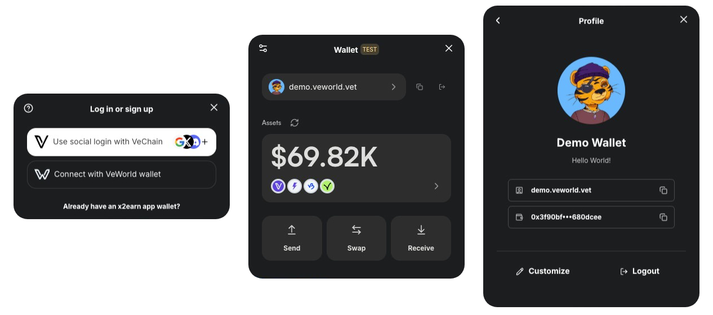

# What's VeChain Kit?

<figure><figcaption></figcaption></figure>

It offers:

* **Seamless Wallet Integration:** Support for VeWorld, WalletConnect, and social logins.
* **Developer-Friendly Hooks:** Easy-to-use React Hooks that let you read and write data on the VeChainThor blockchain.
* **Token Operations:** Send and swap tokens, check balances, manage VET domains, and more—all in one place.
* **Pre-Built UI Components:** Ready-to-use components (e.g., `TransactionModal`) to simplify wallet operations and enhance your users’ experience.

<table data-view="cards"><thead><tr><th></th><th data-hidden data-card-cover data-type="image">Cover image</th><th data-hidden data-card-target data-type="content-ref"></th></tr></thead><tbody><tr><td>Live Demo</td><td><a href=".gitbook/assets/Group 7.png">Group 7.png</a></td><td><a href="https://vechainkit.vechain.org/">https://vechainkit.vechain.org/</a></td></tr><tr><td>NPM Package</td><td><a href=".gitbook/assets/Group 15.png">Group 15.png</a></td><td><a href="https://www.npmjs.com/package/@vechain/vechain-kit">https://www.npmjs.com/package/@vechain/vechain-kit</a></td></tr><tr><td>Getting Started</td><td><a href=".gitbook/assets/Group 14.png">Group 14.png</a></td><td><a href="/broken/pages/WynsdiVyFgwjTR0jH4Dy">Broken link</a></td></tr><tr><td>Customization</td><td><a href=".gitbook/assets/Group 20 (1).png">Group 20 (1).png</a></td><td><a href="/broken/pages/pNrX1DvDYEqzNbVXyznM">Broken link</a></td></tr><tr><td>Components</td><td><a href=".gitbook/assets/Group 21 (1).png">Group 21 (1).png</a></td><td><a href="/broken/pages/p3mxh0i4kJxblF7rmpP1">Broken link</a></td></tr><tr><td>Troubleshooting</td><td><a href=".gitbook/assets/Group 12.png">Group 12.png</a></td><td><a href="/broken/pages/f6Pn5CMW4uoE9Xv2QAJJ">Broken link</a></td></tr></tbody></table>
