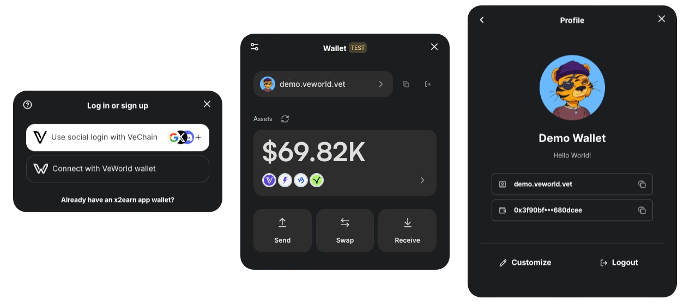

# What's VeChain Kit?

<figure><figcaption></figcaption></figure>

It offers:

* **Seamless Wallet Integration:** Support for VeWorld, WalletConnect, and social logins.
* **Developer-Friendly Hooks:** Easy-to-use React Hooks that let you read and write data on the VeChainThor blockchain.
* **Token Operations:** Send and swap tokens, check balances, manage VET domains, and more—all in one place.
* **Pre-Built UI Components:** Ready-to-use components (e.g., `TransactionModal`) to simplify wallet operations and enhance your users’ experience.

## 🚀 Start with AI

The fastest way to build with VeChain Kit is to hand a prompt to your coding agent (Claude Code, Cursor, or any agent). The prompts below tell the agent to read the relevant [VeChain AI Skill](https://github.com/vechain/vechain-ai-skills) first so it follows current conventions.




```text
Before doing anything, read these VeChain AI Skills so you follow current conventions:
- create-vechain-dapp: https://github.com/vechain/vechain-ai-skills/tree/main/skills/create-vechain-dapp
- vechain-kit: https://github.com/vechain/vechain-ai-skills/tree/main/skills/vechain-kit

Now the task:

Scaffold a new VeChain dApp for me using create-vechain-dapp, with:
- VeChain Kit pre-wired (Privy social login: Google + email, plus VeWorld and WalletConnect)
- Chakra UI v3 (with next-themes) and dark mode by default — follow the next-chakra-v3 example in the vechain-kit repo for wiring the kit's `theme` prop via `useChakraContext().token.var(...)` so theme tokens stay reactive
- A landing page that shows the connected user's address, B3TR balance, and a "Send B3TR" button
- A GitHub Pages deploy workflow ready to use

Name the project "my-vechain-dapp". When done, run `yarn dev` and tell me the URL.
```





```text
Before doing anything, read this VeChain AI Skill so you follow current conventions:
- vechain-kit: https://github.com/vechain/vechain-ai-skills/tree/main/skills/vechain-kit

Now the task:

I already have a Next.js app and I want to add VeChain Kit to it.

1. Install @vechain/vechain-kit and any required peer deps.
2. Find my root layout (app/layout.tsx for App Router or pages/_app.tsx for Pages Router) and wrap it with VeChainKitProvider.
3. Enable Privy social login (Google + email), VeWorld and WalletConnect.
4. Read Privy keys from NEXT_PUBLIC_PRIVY_* and the WalletConnect projectId from NEXT_PUBLIC_WC_PROJECT_ID.
5. Add a <WalletButton /> to my existing header.
6. Don't change my existing Chakra theme.

If you hit peer-dependency conflicts, stop and tell me before applying any fix.
```





**Install the VeChain AI Skills once** to give every future prompt automatic domain context:

```bash
npx skills add vechain/vechain-ai-skills
```

Or in Claude Code: `/plugin marketplace add vechain/vechain-ai-skills`. Browse all 11 skills live at the [VeKit Playground](https://playground.vechainkit.vechain.org/ai-skills).


Prefer to wire it yourself? See the [manual installation guide](docs/quickstart/installation.md).

<table data-view="cards"><thead><tr><th></th><th data-hidden data-card-cover data-type="image">Cover image</th><th data-hidden data-card-target data-type="content-ref"></th></tr></thead><tbody><tr><td>VeKit Playground</td><td><a href=".gitbook/assets/Group 7.png">Group 7.png</a></td><td><a href="https://playground.vechainkit.vechain.org/">https://playground.vechainkit.vechain.org/</a></td></tr><tr><td>Homepage</td><td><a href=".gitbook/assets/Group 7.png">Group 7.png</a></td><td><a href="https://vechainkit.vechain.org/">https://vechainkit.vechain.org/</a></td></tr><tr><td>NPM Package</td><td><a href=".gitbook/assets/Group 15.png">Group 15.png</a></td><td><a href="https://www.npmjs.com/package/@vechain/vechain-kit">https://www.npmjs.com/package/@vechain/vechain-kit</a></td></tr><tr><td>Getting Started</td><td><a href=".gitbook/assets/Group 14.png">Group 14.png</a></td><td><a href="docs/quickstart/installation.md">Getting Started</a></td></tr><tr><td>Customization</td><td><a href=".gitbook/assets/Group 20 (1).png">Group 20 (1).png</a></td><td><a href="docs/customization/theming.md">Customization</a></td></tr><tr><td>Components</td><td><a href=".gitbook/assets/Group 21 (1).png">Group 21 (1).png</a></td><td><a href="docs/components/intro.md">Components</a></td></tr><tr><td>Troubleshooting</td><td><a href=".gitbook/assets/Group 12.png">Group 12.png</a></td><td><a href="docs/troubleshooting/dev-support.md">Troubleshooting</a></td></tr></tbody></table>
