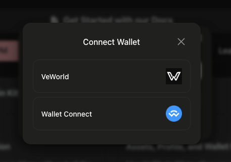

# Connection Types

VeChain Kit supports 3 types of connections:

## 1) Privy

This connection type is often used by organizations like VeBetterDAO, Cleanify, and Greencart. When connected, users can back up their embedded wallets, sign transactions without confirmation prompts, and add login methods. By connecting with Privy, developers use their personal APP\_ID and CLIENT\_ID to create their own app on Privy.

<figure><figcaption></figcaption></figure>


**Pros of self hosting Privy:**

* No UI confirmations on users transactions
* Allow your users to backup their keys and update security settings directly in your app
* Targetted social login methods

**Cons:**

* Price
* Responsibilities to correctly secure your Privy account, since it contains access to user's wallet settings
* Your users will need to login into other apps through ecosystem mode


## 2) Privy Cross App

When users integrate VeChain-kit using "Login with VeChain" and "Ecosystem" logins (eg: Mugshot and Greencart), this will be the default connection type. It is easily recognizable because login and wallet activities will open a secured popup window where the owner of the wallet will approve the actions.

<figure><figcaption></figcaption></figure>


With this type of connection, you can have social login in your app without actually paying Privy.


## 3) Self-custody wallets

This connection type allows login with self custody wallets, and  is using the dapp-kit package under the hood.&#x20;

The available wallets are: VeWorld mobile, VeWorld extension, Sync2, and Wallet Connect for VeWorld mobile.

<figure><figcaption></figcaption></figure>


Other  wallets are available when login in with VeChain, such as Metamask, Rabby, Phantom, Coinbase Wallet, and Ranibow. \
That will use Privy under the hood though, which means the connection type will be "privy-cross-app".



If you want to use vechain-kit but do not care about social login then you can skip the first login modal and directly show the "Connect Wallet" modal like this:

```typescript
import { useDAppKitWalletModal } from '@vechain/vechain-kit';

export const LoginComponent = () => {
  const { open: openWalletModal } = useDAppKitWalletModal();

  return (
    <Button onClick={openWalletModal}>
        Open only "Connect Wallet"
    </Button>
)}
```



When your app is opened inside VeWorld mobile wallet, VeWorld is always enforced as a login choice.

