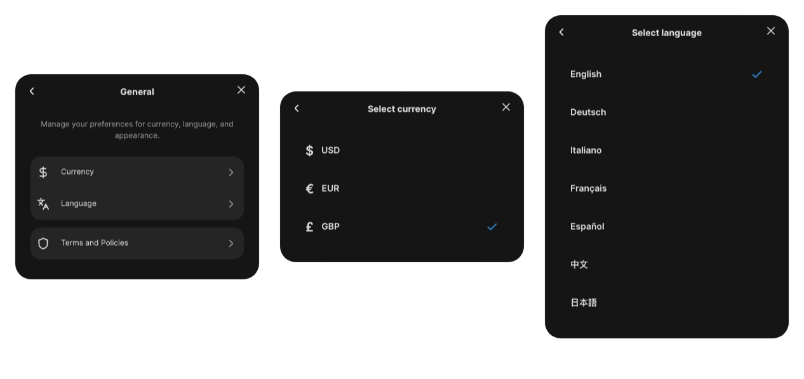

# Language and Currency Synchronization

VeChainKit supports bidirectional synchronization of language and currency preferences between the kit and host applications. This allows changes made in either the kit's settings or the host app to be reflected in both places.

<figure><figcaption></figcaption></figure>

### Overview

The bidirectional sync feature enables:

* **Kit → Host**: When users change language or currency in VeChainKit settings, the host app can be notified and update accordingly
* **Host → Kit**: When the host app changes language or currency, VeChainKit automatically reflects these changes

### Features

#### Language Synchronization

Language preferences are synchronized between:

* VeChainKit's language settings (accessible via Account Modal → Settings → General → Language)
* Host application's i18n instance
* Browser localStorage (`i18nextLng`)

#### Currency Synchronization

Currency preferences are synchronized between:

* VeChainKit's currency settings (accessible via Account Modal → Settings → General → Currency)
* Host application's state
* Browser localStorage (`vechain_kit_currency`)

### Usage

#### Basic Setup

The bidirectional sync is enabled automatically when you use `VeChainKitProvider`. You can optionally provide callbacks to be notified of changes:

```tsx
import { VeChainKitProvider } from '@vechain/vechain-kit';

function App() {
    const handleLanguageChange = (language: string) => {
        console.log('Language changed to:', language);
        // Update your app's language state
    };

    const handleCurrencyChange = (currency: 'usd' | 'eur' | 'gbp') => {
        console.log('Currency changed to:', currency);
        // Update your app's currency state
    };

    return (
        <VeChainKitProvider
            language="en"
            defaultCurrency="usd"
            onLanguageChange={handleLanguageChange}
            onCurrencyChange={handleCurrencyChange}
            // ... other props
        >
            {/* Your app */}
        </VeChainKitProvider>
    );
}
```

#### Reading Current Values

**Using Convenience Hooks**

The easiest way to access current language and currency values:

```tsx
import { useCurrentLanguage, useCurrentCurrency } from '@vechain/vechain-kit';

function MyComponent() {
    const { currentLanguage, setLanguage } = useCurrentLanguage();
    const { currentCurrency, setCurrency } = useCurrentCurrency();

    return (
        <div>
            <p>Current language: {currentLanguage}</p>
            <p>Current currency: {currentCurrency}</p>

            <button onClick={() => setLanguage('fr')}>Change to French</button>

            <button onClick={() => setCurrency('eur')}>Change to EUR</button>
        </div>
    );
}
```

**Using useVeChainKitConfig Hook**

You can also access current values through the config hook:

```tsx
import { useVeChainKitConfig } from '@vechain/vechain-kit';

function MyComponent() {
    const config = useVeChainKitConfig();

    // Current runtime values
    const currentLanguage = config.currentLanguage; // 'fr' (current value)
    const currentCurrency = config.currentCurrency; // 'eur' (current value)

    // Functions to change values from host app
    config.setLanguage('de');
    config.setCurrency('gbp');
}
```

#### Changing Values from Host App

You can change language or currency from your host app, and VeChainKit will automatically sync:

```tsx
import { useCurrentLanguage, useCurrentCurrency } from '@vechain/vechain-kit';
import { useTranslation } from 'react-i18next';

function LanguageSelector() {
    const { currentLanguage, setLanguage } = useCurrentLanguage();
    const { i18n } = useTranslation();

    const handleLanguageChange = (newLang: string) => {
        // Update VeChainKit
        setLanguage(newLang);
        // Your i18n instance will also be updated automatically
    };

    return (
        <select
            value={currentLanguage}
            onChange={(e) => handleLanguageChange(e.target.value)}
        >
            <option value="en">English</option>
            <option value="fr">Français</option>
            <option value="de">Deutsch</option>
        </select>
    );
}
```

#### Listening to Changes

Use the optional callback props to react to changes made in VeChainKit:

```tsx
import { useState, useEffect } from 'react';
import { VeChainKitProvider } from '@vechain/vechain-kit';

function App() {
    const [appLanguage, setAppLanguage] = useState('en');
    const [appCurrency, setAppCurrency] = useState('usd');

    // Sync VeChainKit language changes to your app
    const handleLanguageChange = (language: string) => {
        setAppLanguage(language);
        // Update your app's i18n, routing, etc.
        console.log('Language changed in VeChainKit:', language);
    };

    // Sync VeChainKit currency changes to your app
    const handleCurrencyChange = (currency: 'usd' | 'eur' | 'gbp') => {
        setAppCurrency(currency);
        // Update your app's currency display, API calls, etc.
        console.log('Currency changed in VeChainKit:', currency);
    };

    return (
        <VeChainKitProvider
            language={appLanguage}
            defaultCurrency={appCurrency}
            onLanguageChange={handleLanguageChange}
            onCurrencyChange={handleCurrencyChange}
            // ... other props
        >
            {/* Your app */}
        </VeChainKitProvider>
    );
}
```


In your `i18n.ts` file be sure to check localstorage for setting the language, to avoid issues during refresh.<br>

```typescript
// Custom language detector that checks localStorage first, then prop, then browser
const customLanguageDetector = {
    name: 'customDetector',
    lookup: (options?: { languages?: string[] } | undefined) => {
        // Check localStorage first (for persistence across page refreshes)
        if (typeof window !== 'undefined') {
            const storedLanguage = localStorage.getItem('i18nextLng');
            if (storedLanguage && supportedLanguages.includes(storedLanguage)) {
                return storedLanguage;
            }
        }

        const propLanguage = options?.languages?.[0];

        if (propLanguage && supportedLanguages.includes(propLanguage)) {
            return propLanguage;
        }

        // Get browser language
        const browserLang = navigator.language.split('-')[0];
        if (browserLang && supportedLanguages.includes(browserLang)) {
            return browserLang;
        }

        return 'en'; // fallback
    },
    cacheUserLanguage: (lng: string) => {
        localStorage.setItem('i18nextLng', lng);
    },
};
```


### API Reference

#### VeChainKitProvider Props

**`language?: string`**

Initial language code (e.g., `'en'`, `'fr'`, `'de'`). Defaults to `'en'`.

**`defaultCurrency?: CURRENCY`**

Initial currency code (`'usd'`, `'eur'`, or `'gbp'`). Defaults to `'usd'`.

**`onLanguageChange?: (language: string) => void`**

Optional callback fired when language is changed in VeChainKit settings.

**`onCurrencyChange?: (currency: CURRENCY) => void`**

Optional callback fired when currency is changed in VeChainKit settings.

#### Hooks

**`useCurrentLanguage()`**

Returns the current language and a function to change it.

**Returns:**

* `currentLanguage: string` - Current language code
* `setLanguage: (language: string) => void` - Function to change language

**`useCurrentCurrency()`**

Returns the current currency and a function to change it.

**Returns:**

* `currentCurrency: CURRENCY` - Current currency code
* `setCurrency: (currency: CURRENCY) => void` - Function to change currency

**`useVeChainKitConfig()`**

Returns the full VeChainKit configuration including current language and currency.

**Returns:**

* `currentLanguage: string` - Current runtime language value
* `currentCurrency: CURRENCY` - Current runtime currency value
* `setLanguage: (language: string) => void` - Function to change language
* `setCurrency: (currency: CURRENCY) => void` - Function to change currency
* ... (other config properties)

### Storage

Language and currency preferences are persisted in browser localStorage:

* **Language**: `i18nextLng` (managed by react-i18next)
* **Currency**: `vechain_kit_currency`

Changes persist across page reloads and browser sessions.

### Notes

* Use `currentLanguage` and `currentCurrency` from `useVeChainKitConfig()` to get the current runtime values.
* Changes made in VeChainKit settings automatically update localStorage and trigger callbacks.
* Changes made via `setLanguage()` or `setCurrency()` from the host app automatically sync to VeChainKit.
* The sync works bidirectionally - changes in either direction are reflected in both places.
